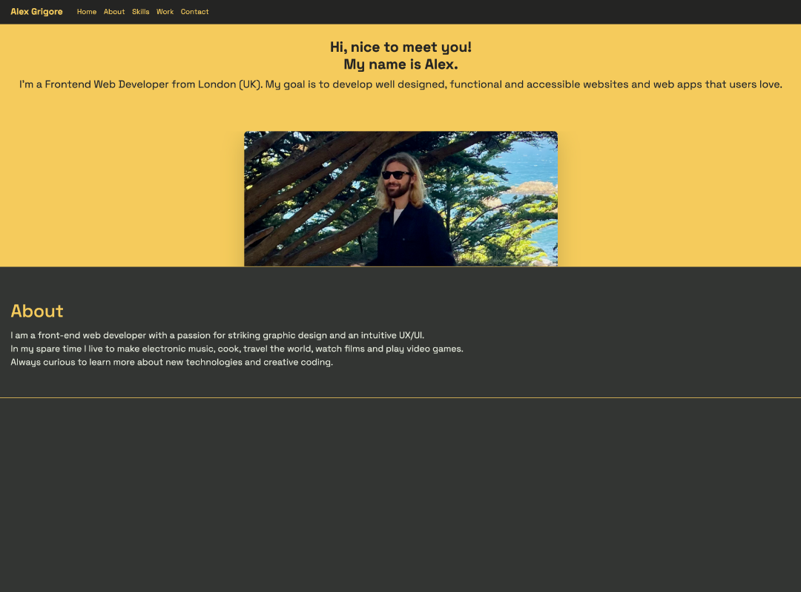

## Portfolio Website

### Description

A nicely laid out portfolio created using Bootstrap components to showcases information about skills, projects and means of contact.
 
 
This is a graded assignment for module three of edX's Skills Boot Camp in Front-End Web Development.

## User Story

AS A front-end developer
 
I WANT a portfolio that is built using Bootstrap and highlights my best work and has contact links
 
SO THAT potential employers can easily understand my skills and how to contact me

## Acceptance Criteria

Application is built primarily with the use of Bootstrap framework
 
Application deployed at live URL
 
Application loads with no errors
 
Application GitHub URL submitted
 
GitHub repository contains application code
 
Repository follows best practices for file structure and naming conventions
 
Repository follows best practices for class/id naming conventions, indentation, quality comments, etc
 
Repository contains multiple descriptive commit messages
 
Repository contains quality readme with description, screenshot, link to deployed application

### Usage

The following image shows the web application's appearance and functionality:

> **Note**: This layout is designed to be responsive.

The following link will take you to the deployed webpage <https://agworkgit.github.io/bootstrap-portfolio/>

## License

MIT License

Copyright (c) 2023 Alex Grigore

Permission is hereby granted, free of charge, to any person obtaining a copy
of this software and associated documentation files (the "Software"), to deal
in the Software without restriction, including without limitation the rights
to use, copy, modify, merge, publish, distribute, sublicense, and/or sell
copies of the Software, and to permit persons to whom the Software is
furnished to do so, subject to the following conditions:

The above copyright notice and this permission notice shall be included in all
copies or substantial portions of the Software.

THE SOFTWARE IS PROVIDED "AS IS", WITHOUT WARRANTY OF ANY KIND, EXPRESS OR
IMPLIED, INCLUDING BUT NOT LIMITED TO THE WARRANTIES OF MERCHANTABILITY,
FITNESS FOR A PARTICULAR PURPOSE AND NONINFRINGEMENT. IN NO EVENT SHALL THE
AUTHORS OR COPYRIGHT HOLDERS BE LIABLE FOR ANY CLAIM, DAMAGES OR OTHER
LIABILITY, WHETHER IN AN ACTION OF CONTRACT, TORT OR OTHERWISE, ARISING FROM,
OUT OF OR IN CONNECTION WITH THE SOFTWARE OR THE USE OR OTHER DEALINGS IN THE
SOFTWARE.

## Badges

